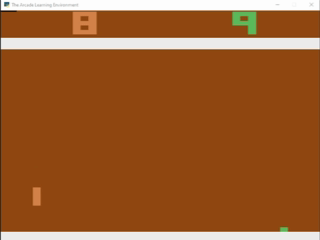

# 🏓 Atari Pong — AI Learning from Scratch

<div align="center">
  
  <p><em>Trained DQN agent playing Atari Pong</em></p>
  
  [](https://github.com/ysomu88/atari-recreation/actions)
</div>

## What Does This Do?

This project teaches a neural network how to play Pong:
- It starts knowing nothing about the game  
- Watches hundreds of thousands of frames (images) from the screen  
- Learns what actions lead to winning points through trial and error  
- Eventually becomes good enough to consistently beat random chance

Think of it like watching someone learn piano by hitting keys randomly at first, then slowly getting better over time.

---

## Quick Start 🚀

### Step 1: Install Python Dependencies

Open your **Command Prompt** or **PowerShell**, navigate into the cloned repo directory. For example on Windows, if you cloned to Downloads:

```bat
cd C:\Users\<USER>\Downloads\atari-recreation
```

If you don't have a virtual environment yet, create one first (recommended):

**Windows Command Prompt:**
```bat
py -m venv .venv
\.venv\Scripts\activate.bat
pip install torch torchvision gymnasium[atari] autorom[accept-rom-license] opencv-python tensorboard
```

Then verify everything is installed correctly:

```bat
python train.py --help
```

---

### Step 2: Start Training!

Just run this command in the same terminal window where Python dependencies are set up. **Yes, that's it.** One line and training begins automatically.

**Training Command:**
```bat
'.\.venv\Scripts\python.exe' train.py --total_steps 500000
```

The script will:  
- Load Atari Pong (via the emulator)  
- Create a fresh AI agent from zero knowledge  
- Train it for up to `--total_steps` environment steps  
- Automatically save checkpoints and log progress  

---

## Training Progress 📊

You'll know your model is improving when:

| Step Range | What You'll See                          | Expected Reward/episode |
|------------|------------------------------------------|-------------------------|
| First ~5,000   | Initial setup messages appear           | N/A                     |
| ~50k–150k     | Agent starts blocking shots occasionally  | -21 → -10 (or better)   |
| ~300k+        | Positive scores become common             | 0 → +15 or higher       |

> **Tip:** You can see graphs at `http://localhost:6006` showing how well the AI is doing over time!

---

## View Training Progress 📊

After training completes, run this command to view your agent's progress in real-time. It will load the most recent saved model and display performance metrics via TensorBoard dashboard.

**View Training Progress:**
```bat
'.\.venv\Scripts\tensorboard.exe' --logdir runs
```

Then visit `http://localhost:6006` to see reward/loss graphs live updating as training continues.

---

## Evaluate Your Trained Agent 🎮

Now comes the fun part—watching your AI play Pong after training! The trained model will show up in a window and you can watch it handle balls, block shots, and occasionally score points.

**Step 1: Install Additional Graphics Dependencies (Optional)**  
For proper game rendering with OpenCV video capture support on Windows:
```bat
pip install opencv-python-headless scikit-image pyvirtualdisplay ffmpeg
```

**Note:** If you have problems viewing rendered gameplay due to display limitations, that's normal—AI still trains and learns fine even without visible render output. The agent plays via emulator simulation mode by default anyway so this step is optional for casual users who just want graphs instead of visual rendering. Just skip ahead if those steps seem problematic or unclear!

**Step 2: Run Evaluation Mode**  
Load your saved model checkpoint file (from previous training run):
```bat
".\.venv\Scripts\python.exe" eval.py --checkpoint checkpoints/dqn_episode_<latest_modified_partition>.pth --episodes 5
```


- Each episode's reward score printed to console output  
- Average performance across multiple games (increase `--episodes` flag for more samples)

> **Tip:** If your GPU has 8GB+ VRAM you might want to keep running training longer since stronger models generally achieve better results. Otherwise ~300k steps gets decent baseline behavior already suitable for demonstration purposes.

---

## Optional Commands 💡

### Resume Training Later
If you need to pause and resume later, use a saved checkpoint file from your previous training run:

```bat
'.\.venv\Scripts\python.exe' train.py --total_steps 1000000 --resume checkpoints/dqn_episode_400.pth